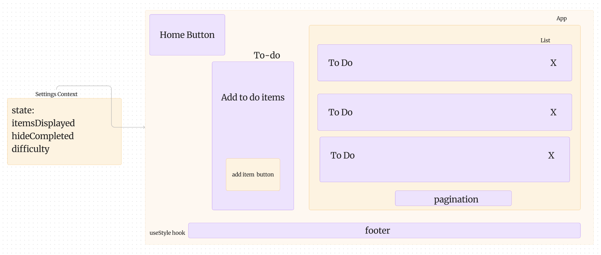

# Context API
## LAB - Class 31
### Author: Coriana Williams

### Problem Domain# Phase 1 Requirements
In Phase 1, we’re going to perform some refactoring of a Todo application built by another team. This application mixes application state and user settings at the top level and passes things around. It was a good proof of concept, but we need to make this production ready.

Phase 2 Requirements

Phase 3 Requirements

Phase 4 Requirements

### Links and Resources
- 

- 
## Collaborators
Kenya Womack

### Setup
#### `.env` requirements (where applicable)
for now I have none and do not require one
#### How to initialize/run your application (where applicable)
- e.g. `npm start`
#### How to use your library (where applicable)
#### Features / Routes
- Feature One: Details of feature
- GET : `/hello` - specific route to hit
#### Tests
- npm test
#### UML

